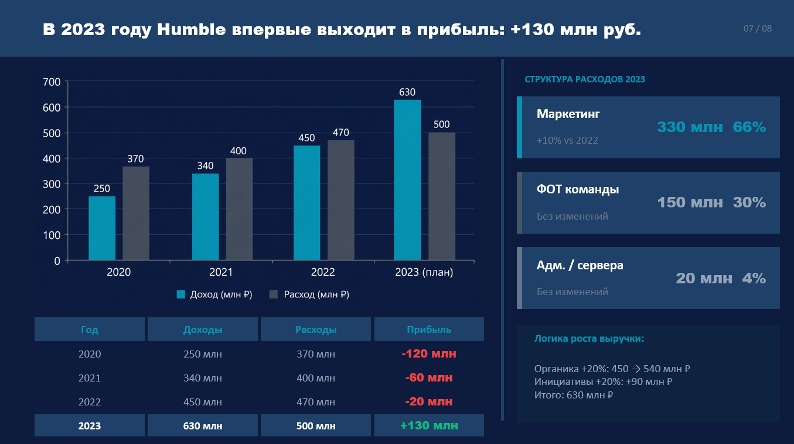
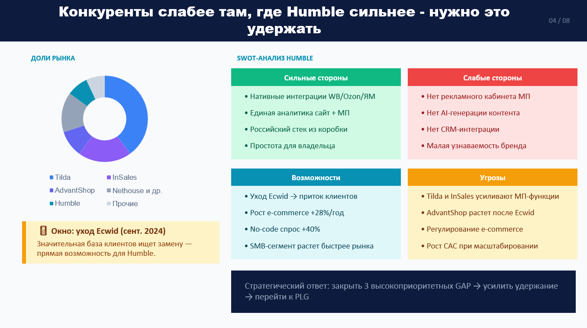
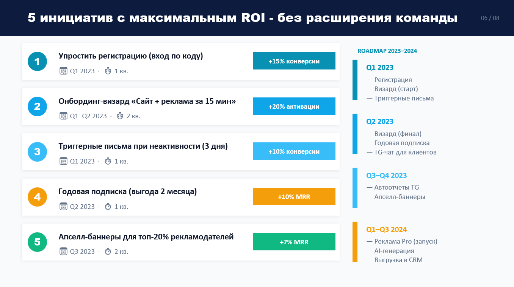

# Humble: продуктовая стратегия — переход к окупаемому росту

**Продукт:** Humble — no-code SaaS-конструктор интернет-магазинов для SMB  
**Роль:** Product Manager / Strategy Lead  
**Контекст:** аудит стратегии и roadmap перехода к прибыльному Product-led Growth

**Результат:** unit economics → разворот через P&L → ICE/RICE → финансовый эффект **−20 млн ₽** (2022) → **+130 млн ₽** (2023).

---

## Executive Summary

Стратегия разворота после +30% YoY при цели +50%. Проблема — рост без unit economics (CAC > LTV). Решение — **окупаемый рост** через LTV/CAC, retention и монетизацию экосистемы (МП, CRM, учёт).

**Ключевые решения:**
- **Диагностика:** разрыв между привлечением и unit economics
- **Смена фокуса:** ARPU, retention, интеграции вместо performance-маркетинга
- **PMF:** сегмент SMB ~15% рынка конструкторов РФ; окно через уход Ecwid/Shopify
- **Roadmap:** AI-контент, автоотчёты, реклама МП, выгрузка в CRM

## Компоненты стратегии

### Рынок и позиционирование

- **TAM/SAM/SOM:** ~80 тыс. SMB в РФ; SOM = 15% SAM (~525 млн ₽ ARR); позиция 86% от SOM
- **Позиционирование:** no-code с нативной интеграцией МП vs Tilda и InSales
- **Тренды:** уход Shopify/Ecwid, рост WB/Ozon +28%/год

### ЦА и gap-анализ

- **Сегменты:** селлеры WB/Ozon (40%), D2C (25%), мигранты (25%), новички (10%)
- **Gaps:** реклама МП из одного окна, AI SEO, автоотчётность, CRM/касса → churn и LTV

### Unit economics

- **Тариф:** ~3 999 ₽/мес., подписка «всё включено»
- **P&L:** −20 млн ₽ (2022) → +130 млн ₽ (2023); CAC-оптимизация, ARPU через апселл
- **Метрики:** Retention M3 85%, Churn <5%, NPS >40, триал→платная ≥50%, CAC ≤ 2 000 ₽
- **[P&L + ICE-приоритизация (Google Sheets)](https://docs.google.com/spreadsheets/d/1w1Hg0PlN7EyyS_HxU6t_hDtJ2jXzIKiJp-VgqDcqI64/edit?usp=sharing)**

## Roadmap

| Инициатива | Влияние | Затраты | Метрика |
| :--- | :--- | :--- | :--- |
| Автоотчёты в Telegram | Высокое | Низкие | Retention M3, WAU |
| AI SEO-тексты | Высокое | Средние | Activation, Conversion |
| CRM/кассы | Высокое | Высокие | LTV, Churn |
| Тариф «Реклама Pro» | Среднее | Низкие | ARPU, MRR |

## Артефакты

  
*+130 млн ₽ прибыли в 2023 без расширения команды.*

  
*Нативные интеграции МП vs нет рекламного кабинета и AI.*

  
*5 инициатив с максимальным ROI.*

## Ссылки

- [Карта стратегии в Miro](https://miro.com/welcomeonboard/SFMxY3hHbmVVUzEzRHB5QXo4MVd5Z3crcUhOY3ZpR1FDT1VlM2tiQnRrQ3RLM205OXMyek1qNEJWOVoraEM2NHVEWUZUWE1zc3haWkt2czNtYjhpbXR5WE9MQ0N3U1dFcnY4ZmxaaDJYSnk0VCt1REpQdSthWWV2dVp5amFUcUZ3VHhHVHd5UWtSM1BidUtUYmxycDRnPT0hdjE=?share_link_id=741387842889)
- [Презентация стратегии (PDF)](humble_strategy_final.pdf)
